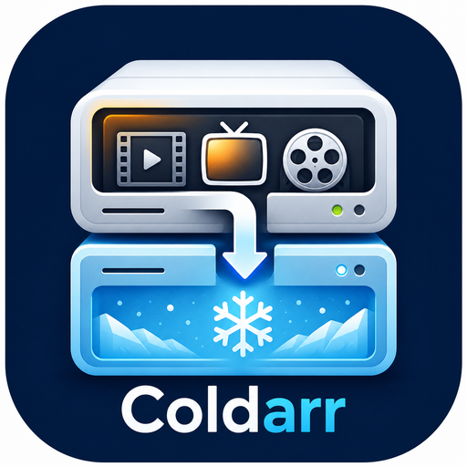

<p align="center">
  
</p>

<h1 align="center">Coldarr</h1>

A policy-based storage-tiering balancer for Radarr/Sonarr libraries.

Coldarr looks at disk usage and library metadata (tags, quality profile,
monitored state, series ended/continuing, age, size), decides which movies
and series belong on hot vs. cold storage, and asks Radarr/Sonarr to
relocate them - so their databases stay the source of truth. Coldarr never
moves files on disk directly.

It has both a CLI and a web GUI, backed by the same config - use whichever
fits, or mix them (e.g. configure connections in the GUI, run `apply` from
cron).

## Status: first pass / MVP

Implemented:

- Radarr + Sonarr inventory (tags, quality profile, monitored/queue state)
- Disk usage per configured path, with mount-point safety checks
- A transparent, tunable scoring engine (protected / hot / cold), including
  Jellyfin Favorites (any user) as a protection signal
- A planner that packs cold tiers toward their target usage by moving every
  cold-eligible item off hot storage, limited only by cold destination
  room - hot storage is runoff, never steered toward a usage level
- Cooldown tracking so nothing gets moved twice in a short window
- Connections (Radarr/Sonarr/Jellyfin) stored encrypted at rest, with
  per-app environment-variable overrides that always take precedence
- A web GUI (`coldarr serve`) for connections, tiers, dashboard, plan
  preview, apply, and move history - and an equivalent CLI (`report` /
  `plan` / `apply` / `connections`)
- Optional OIDC authentication for the web GUI, with PKCE, group
  authorization, encrypted client-secret storage, and environment-variable
  overrides
- Moves executed through Radarr's/Sonarr's own bulk "move" API, so their
  databases stay correct
- Optional Jellyfin library refresh trigger after a successful apply

Deliberately out of scope for this pass (see the bottom of this file):
Plex, Seerr/Overseerr request history, Jellyfin play-history/watch-count
scoring (Favorites are in, play counts aren't - yet), a fully-automatic
scheduled mode, and torrent client awareness.

## How a run works

1. **Inventory** - check every configured tier path (exists? mounted, if
   `require_mount` is set? how full?), then pull every movie from Radarr
   and every series from Sonarr, including tags, quality profile, and
   whether an active download/import is in progress for it.
2. **Score** - each item is evaluated into one of three buckets:
   - `protected` - tagged `never-move`/`keep-hot`/etc, marked Favorite by
     any Jellyfin user, or has an active download/import. Never touched.
   - `hot` - should stay on primary storage (recently added, a
     currently-airing series, or just didn't score high enough to be
     cold).
   - `cold` - safe to relocate to overflow storage, with a score used to
     rank *which* cold items move first.
3. **Plan** - Coldarr does not steer hot storage toward any usage level -
   it's runoff, not a control variable, and it's fine for it to sit
   however full it ends up. Every cold-scored item currently on a hot
   path is a move candidate (coldest and largest first), assigned to
   whichever cold-tier path has room under its `target_used_percent` (the
   fill goal); if nothing has target room, it falls back to whatever has
   room under `max_used_percent` (the hard ceiling, never crossed either
   way). Among viable destinations it prefers the fullest-but-not-full
   one, so satellites get packed one at a time instead of spread thin.
   Items moved within `cooldown_days` are skipped.
4. **Apply** - runs in the background and returns a live-updating status
   page/log immediately; the moves themselves are serialized **one at a
   time per destination physical volume** (never more than one write in
   flight against the same disk), while different volumes proceed in
   parallel. Hot storage, a read source, isn't throttled. After asking
   Radarr/Sonarr to relocate an item (`moveFiles: true`), Coldarr watches
   the destination's disk usage until the transfer has actually landed
   before starting the next item queued for that same volume - the move
   API returns once the operation is queued, not once the bytes are on
   disk, so trusting it alone isn't enough. Only one apply can run at a
   time, system-wide, enforced by a crash-safe lock. Every completed move
   is logged to the history file with its real completion time, then
   Jellyfin is asked to refresh once the whole run finishes.

Nothing above ever happens without `report`/`plan` (or the GUI's dashboard
and plan page) being read-only, or without confirming before an apply
executes - a `--yes` flag on the CLI, a JS confirm dialog in the GUI.

**Why one destination volume at a time:** firing every move in a plan at
once - many large simultaneous writes across several files/drives - is a
very different load profile than steady, one-at-a-time movement, and can
saturate a storage subsystem badly enough to make a whole host
unresponsive. This isn't hypothetical; it happened during testing. The
serialization is keyed by physical device, not tier name, so it also
catches two differently-named tier paths that turn out to be the same
disk (see [Shared volumes](#shared-volumes)).

## Setup

```
go build -o coldarr ./cmd/coldarr
./coldarr connections set radarr --url http://localhost:7878 --api-key <key>
./coldarr connections set sonarr --url http://localhost:8989 --api-key <key>
cp coldarr.example.yaml coldarr.yaml   # or just add tiers via `coldarr serve`
```

Radarr/Sonarr API keys can be found under Settings -> General in each app.

## Connections

Radarr/Sonarr/Jellyfin connection info (URL + API key) is **not** part of
`coldarr.yaml`. It's stored encrypted at rest, alongside the config file,
in `connections.enc.json` (with a random key auto-generated on first run
at `.coldarr.key` next to it). You can set/inspect it three ways, in order
of precedence:

1. **Environment variables** - `RADARR_URL` / `RADARR_API_KEY` (and
   `SONARR_*`, `JELLYFIN_*`, plus `JELLYFIN_ENABLED`). If set, these
   always win, regardless of what's stored - useful for infra-as-code
   deployments that don't want to touch the GUI at all.
2. **The web GUI's Connections page** - fill in URL + API key, hit "Test
   connection" to confirm it actually works, then Save. If an app's env
   vars are set, its fields show locked with a note explaining why.
3. **The CLI**: `coldarr connections set/list/test/delete`.

*Threat model:* this protects against the connection file leaking through
casual exposure (pasted into a support thread, an accidentally-committed
volume backup) - not against an attacker who already has read access to
the container/filesystem, since the key lives right next to the
ciphertext on the same volume.

## Usage

CLI:

```
coldarr report   # tier usage + scored inventory, read-only
coldarr plan     # builds and prints a move plan, makes no changes
coldarr apply    # builds a plan, prompts, then executes it
coldarr apply -y # skip the confirmation prompt (e.g. for cron/systemd)
coldarr connections list|set|test|delete <radarr|sonarr|jellyfin>
coldarr serve    # run the web GUI
```

All commands take `--config path/to/coldarr.yaml` (default
`./coldarr.yaml`, overridable via the `COLDARR_CONFIG` env var).

Web GUI (`coldarr serve`, default `:8478`, override with `--listen` or
`COLDARR_LISTEN_ADDR`):

- **Dashboard** - tier usage/space allotment, library item counts by
  decision (protected/hot/cold), connection status.
- **Plan** - the same dry-run preview as the CLI's `plan`, with an Apply
  button (confirm dialog, then executes through Radarr/Sonarr) and live
  progress of the current (or most recent) apply run, auto-refreshing
  until it finishes.
- **History** - every move Coldarr has executed, with a size-verification
  check to catch a transfer a crash left half-done.
- **Settings** - Connections (configure/test Radarr/Sonarr/Jellyfin),
  Tiers (add/edit/delete hot and cold tiers, live per-path disk usage),
  Auth (optional OIDC login and group access), Notifications (an Apprise
  webhook for run summaries), and Scheduler (optionally run the plan or a
  cold-storage health check on a schedule - see [FEATURES.md](FEATURES.md)
  for details).

OIDC auth is disabled by default. The GUI can view connection status and
trigger real moves, so enable Settings -> Auth, keep it behind your own
trusted network boundary, or avoid publishing its port directly to the
internet.

## Docker

```
docker build -t coldarr .
cp docker-compose.example.yml docker-compose.yml   # edit tier paths, ports
cp .env.example .env                                # only if using env-var connections

docker compose up -d
# then open http://localhost:8478 and use the Settings pages,
# or configure everything via env vars / a mounted coldarr.yaml instead
```

The default command is `serve` - a persistent GUI, not a one-shot job.
Everything Coldarr persists (`coldarr.yaml`, the encrypted connection
store + its key, move history) lives under one bind-mounted `/config`
directory.

Prefer the CLI / scripting instead of the GUI? Override `command`:

```
docker compose run --rm coldarr report
docker compose run --rm coldarr plan
docker compose run --rm coldarr apply --yes
```

```
# /etc/cron.d/coldarr - rebalance every night at 4am
0 4 * * * root docker compose -f /path/to/docker-compose.yml run --rm coldarr apply --yes
```

**Environment variables** the image understands directly:

| Variable               | Purpose                                                          |
| ---------------------- | ----------------------------------------------------------------- |
| `PUID` / `PGID`        | uid/gid the process runs as, so it can read your bind mounts. Same convention as Radarr/Sonarr/Jellyfin images. Default `1000`/`1000`. |
| `TZ`                   | container timezone, mostly cosmetic for log timestamps.           |
| `COLDARR_CONFIG`       | path to the config file. Default `/config/coldarr.yaml` (via the image's `/config` working directory). |
| `COLDARR_LISTEN_ADDR`  | address `serve` listens on. Default `:8478`.                      |
| `COLDARR_OIDC_ENABLED` / `COLDARR_OIDC_ISSUER_URL` / `COLDARR_OIDC_CLIENT_ID` / `COLDARR_OIDC_CLIENT_SECRET` | OIDC auth overrides. When any are set, env values win over GUI-saved values. |
| `COLDARR_OIDC_REDIRECT_URL` / `COLDARR_OIDC_REQUIRED_GROUP` / `COLDARR_OIDC_GROUPS_CLAIM` / `COLDARR_OIDC_AUTO_LOGIN` | Optional OIDC details. Required group defaults to `coldarr`; groups claim defaults to `groups`. |
| `COLDARR_OIDC_DISABLE_AUTO_LOGIN` | set to `true` to force the login button page even when saved auth settings have auto-login on. Set `COLDARR_OIDC_ENABLED=false` to disable OIDC entirely for troubleshooting. |
| `RADARR_URL` / `RADARR_API_KEY` (`SONARR_*`, `JELLYFIN_*`, `JELLYFIN_ENABLED`) | connection overrides - see [Connections](#connections). |
| `COLDARR_SETTLE_CHECK_INTERVAL` / `COLDARR_SETTLE_STABLE_CHECKS` / `COLDARR_SETTLE_MAX_WAIT` | tune how long `apply` waits for a move to actually land on disk before starting the next one queued for the same volume (Go duration strings, e.g. `5s`/`6h`). Defaults suit typical local disks; raise `MAX_WAIT` for very large files on slow/network storage. |

**Everything else** (tiers, tags, thresholds) goes through `coldarr.yaml`,
which supports `${VAR}` substitution against whatever environment
variables you pass to the container.

Tier paths must be bind-mounted at the *same path Radarr/Sonarr use
internally* - Coldarr compares its own disk checks and the root folder
paths the Arr APIs report as literal strings, so a mismatched mount looks
like a misplaced or unavailable path.

## Tiers

A tier is a named policy (allowed media types, whether paths must be real
mount points, and for cold tiers, target/max usage) applied to one or more
physical paths. Each path is checked independently - a tier is a shared
policy across drives, not a pooled volume. See `coldarr.example.yaml` for
a worked example with one hot tier (the primary NAS) and two cold tiers
(movies and TV split across satellite drives) - or just add them through
the GUI's Tiers page, which writes the same file.

**Hot tiers have no `target_used_percent`/`max_used_percent`.** Coldarr
doesn't steer primary storage toward any usage level - it's runoff. In
the ideal case your cold drives sit at 99% and hot sits at whatever's left
over, and that's fine. If you want to know how full hot currently is,
the dashboard/`report` still show it - it just isn't a control variable.

**Cold tiers use both fields as a two-step packing goal:**
`target_used_percent` is what Coldarr actively packs toward; if nothing
has room under target, it falls back to `max_used_percent` - the hard
ceiling, never crossed. `max_used_percent` has no built-in cap - if you
want a satellite drive packed to 100%, set it to 100. Coldarr will
respect that.

Note: saving tiers through the GUI rewrites the whole `coldarr.yaml` file,
so hand-added comments won't survive a GUI save.

### Mount safety

Setting `require_mount: true` on a tier makes Coldarr verify that each of
its paths is a genuine mount point (a distinct filesystem from its parent
directory) before treating it as usable. This exists specifically to
catch the case where a satellite drive is unplugged or fails to mount:
without this check, Coldarr could otherwise "successfully" write into the
empty directory left behind on the root filesystem. A path that fails
this check is reported as unavailable and excluded from planning entirely
- Coldarr never falls back to using it anyway.

### Shared volumes

Sometimes two configured paths - even across different tiers, like
`Movies (Hot)` and `TV (Hot)` - are actually the same physical volume or
cluster storage, just different subdirectories. Optimizing between them
independently would be nonsense: filling one eats into the exact same
free space the other reports having.

Coldarr detects this **automatically**, by comparing each path's device
ID (the same technique `du -x`/`find -xdev` use to detect filesystem
boundaries) - there's nothing to configure, and it can't drift out of
sync the way a manually-declared grouping could if a mount changes later.
Paths sharing a volume show up flagged as such in `report` and the
dashboard/Tiers page, and the planner treats their capacity as one shared
pool: moving into one is reflected on the other, so it can never
double-commit the same disk across two differently-named destinations.

## Scoring

See [internal/scoring/scoring.go](internal/scoring/scoring.go) for the
full, small set of rules. In short: tags, an active download, or a
Jellyfin Favorite mark can force `protected` or `hot` outright; otherwise
items accumulate a score from age, size, a series having ended, time
since last aired, a low-priority quality profile, and unmonitored/missing
state. Items at or above `cold_score_threshold` are cold candidates,
ranked by that score. (Policy thresholds like these are still YAML-only
for now - not yet exposed in the GUI.)

**Jellyfin Favorites:** if Jellyfin is connected and enabled, Coldarr
fetches every user's favorited movies/series and matches them back to
Radarr/Sonarr items by path - anything favorited by anyone is protected,
same as a `never-move` tag. Matching is by path, so this only works
correctly if Jellyfin sees the same paths Radarr/Sonarr do (see
[Docker's path note](#docker) below). If the favorites fetch fails for
any reason, Coldarr proceeds without that protection for the run and
surfaces a warning in `report`/`plan`/the dashboard rather than failing
outright or silently skipping it.

## More

- [FEATURES.md](FEATURES.md) - the plain-English version of what this does
- [DEVELOPMENT.md](DEVELOPMENT.md) - building, testing, CI/CD, releasing,
  and the roadmap
- [CONTRIBUTING.md](CONTRIBUTING.md) - branch/commit/PR conventions
- Licensed under [MIT](LICENSE.md)
