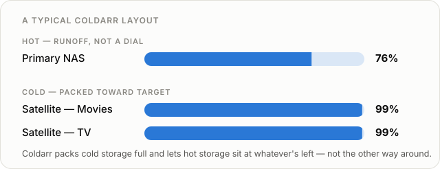

<p align="center">
  
</p>

<h1 align="center">Coldarr</h1>

<p align="center">
  <a href="LICENSE.md"></a>
  <a href="https://github.com/voc0der/Coldarr/releases/latest"></a>
  <a href="https://github.com/voc0der/Coldarr/actions/workflows/ci.yml"></a>
  <a href="CONTRIBUTING.md#coverage"></a>
  <a href="https://hub.docker.com/r/voc0der/coldarr"></a>
</p>

<p align="center">A policy-based storage-tiering balancer for Radarr/Sonarr libraries.</p>

Your hot storage is expensive, redundant, and always running out of
space; your cold/satellite drives are cheap and built to absorb the
overflow. Coldarr looks at your library (age, size, tags, quality
profile, monitored state, Jellyfin Favorites) and your disk usage, decides
what's safe to push to overflow storage, and asks Radarr/Sonarr to move it -
so their databases stay the source of truth. Coldarr never touches files on
disk directly, and nothing moves without a dry-run `report`/`plan` first.

CLI and web GUI, same config either way - mix them (e.g. configure
connections in the GUI, then automate with cron or the GUI's own
Settings > Scheduler).

<p align="center">
  
</p>

## Quick start

```
curl -o docker-compose.yml https://raw.githubusercontent.com/voc0der/Coldarr/main/docker-compose.example.yml
# edit tier paths, ports in docker-compose.yml, then:
docker compose up -d
```

Open `http://localhost:8478`, add your Radarr/Sonarr/Jellyfin connections
and tiers under Settings, then use the Plan page to preview a move and
Apply it.

> [!NOTE]
> Get the optional Restore User Data After Move plugin from its
> [GitHub repository](https://github.com/voc0der/jellyfin-plugin-restore-userdata-after-move).

Prefer the CLI, or building from source? See [CLI.md](CLI.md). Tuning
tiers, notifications/scheduling, or the full Docker env var reference? See
[CONFIGURATION.md](CONFIGURATION.md).

## Learn more

- [FEATURES.md](FEATURES.md) - what Coldarr does and why, in plain English
- [CLI.md](CLI.md) - building from source and the full CLI command reference
- [CONFIGURATION.md](CONFIGURATION.md) - connections, tiers, Docker, scoring,
  and the web GUI reference
- [DEVELOPMENT.md](DEVELOPMENT.md) - building, testing, CI/CD, releasing,
  and the roadmap
- [CONTRIBUTING.md](CONTRIBUTING.md) - branch/commit/PR conventions
- Licensed under [MIT](LICENSE.md)
- Radarr/Sonarr/Jellyfin logos in the web GUI's Links column are vendored
  from [selfh.st/icons](https://github.com/selfhst/icons), licensed
  [CC BY 4.0](https://creativecommons.org/licenses/by/4.0/)
