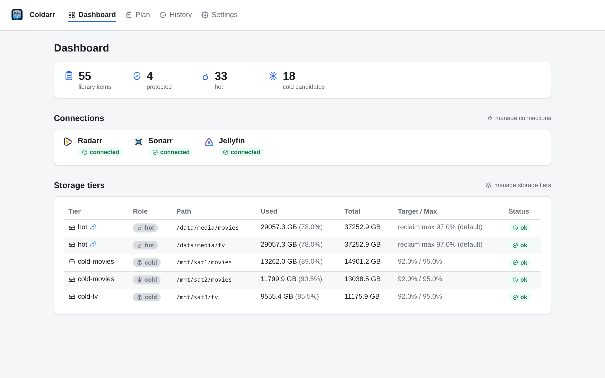

<h1>
  
  Coldarr
</h1>

[](LICENSE.md)
[](https://github.com/voc0der/Coldarr/releases/latest)
[](https://github.com/voc0der/Coldarr/actions/workflows/ci.yml)
<a href="https://voc0der.github.io/Coldarr/development/contributing/#coverage"></a>
[](https://github.com/voc0der/Coldarr/issues)
[](https://hub.docker.com/r/voc0der/coldarr)
[](https://hub.docker.com/r/voc0der/coldarr)

Move older movies and shows off your main storage and onto overflow drives. Tell Coldarr which drives are which, and it works out what's safe to move and has Radarr and Sonarr do the moving, so their libraries always match what's on disk. New additions, active downloads, and Jellyfin favorites stay on your main storage. Preview each plan first, or put it on a schedule. See the [full feature list](https://voc0der.github.io/Coldarr/features/).

**[Documentation](https://voc0der.github.io/Coldarr/)** · [Quick start](https://voc0der.github.io/Coldarr/getting-started/) · [Configuration](https://voc0der.github.io/Coldarr/configuration/)

<hr>

<picture>
  <source media="(prefers-color-scheme: dark)" srcset="./docs/assets/screenshots/dashboard-dark.png">
  
</picture>
<br>
<sub>More screenshots in the <a href="https://voc0der.github.io/Coldarr/screenshots/">gallery</a>.</sub>

## Setup

### Docker

1. Download the [example compose file](https://github.com/voc0der/Coldarr/blob/main/docker-compose.example.yml):

```bash
curl -L https://raw.githubusercontent.com/voc0der/Coldarr/main/docker-compose.example.yml -o docker-compose.yml
```

2. Set your media paths in it, then start it:

```bash
docker compose up -d
```

3. Open `http://localhost:8478` and sign in with the password from `docker compose logs coldarr`.

The [quick start](https://voc0der.github.io/Coldarr/getting-started/) walks through connecting Radarr, Sonarr, and Jellyfin, adding your drives, and your first plan. Docker environment variables: [reference](https://voc0der.github.io/Coldarr/configuration/docker/#environment-variables).

> [!NOTE]
> The optional [Restore User Data After Move](https://github.com/voc0der/jellyfin-plugin-restore-userdata-after-move) Jellyfin plugin puts back the watch history a move leaves behind.

#### Build manually
See [Building from source](https://voc0der.github.io/Coldarr/usage/cli/#building-from-source).

## Contributing

Review the [contributing guide](https://voc0der.github.io/Coldarr/development/contributing/) for contributor guidelines; pull requests and issues for bugs or feature requests are welcome.

## License

[MIT](LICENSE.md). Radarr, Sonarr, and Jellyfin logos in the web interface come from [selfh.st/icons](https://github.com/selfhst/icons), licensed [CC BY 4.0](https://creativecommons.org/licenses/by/4.0/).
