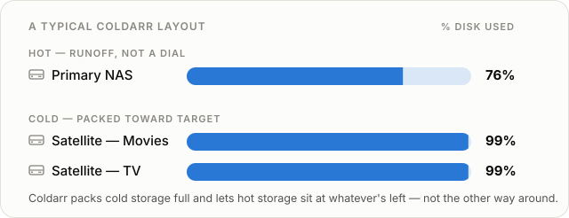

# Coldarr

**Storage tiering for Radarr and Sonarr libraries.** Keep recent and favorite
media on primary storage and move cold titles to overflow drives.

Coldarr looks at your library's age, size, tags, quality profiles, monitored
state, Jellyfin Favorites, and available disk space. It asks Radarr and
Sonarr to move eligible items, so their databases stay the source of truth.
Coldarr never moves files directly.

[Get started](getting-started.md){ .md-button .md-button--primary }
[See the features](features.md){ .md-button }

## Preview, then apply

Use the web interface or CLI to inspect storage and build a dry-run plan.
Review what would move, why, and where before applying it. Both interfaces
use the same configuration, and scheduled jobs stay off until enabled.

[Browse the screenshot gallery](screenshots.md).

## Find your guide

-   :lucide-rocket: **[Quick start](getting-started.md)**

    ---

    Run Coldarr in Docker, connect your services, and review a first plan.

-   :lucide-workflow: **[How a run works](usage/how-it-works.md)**

    ---

    How items are scored, how moves are planned, and why they run one at a
    time per drive.

-   :lucide-app-window: **[Web interface](usage/web-interface.md)**

    ---

    The dashboard, plans, move history, and settings.

-   :lucide-square-terminal: **[CLI](usage/cli.md)**

    ---

    Run reports and plans from a shell, or automate applies with cron.

-   :lucide-sliders-horizontal: **[Configuration](configuration/index.md)**

    ---

    Connections, storage tiers, Docker environment variables, and scoring
    policy.

-   :lucide-clapperboard: **[Jellyfin](configuration/jellyfin.md)**

    ---

    Keep Favorites on hot storage and artwork intact after a move.

Building, testing, or contributing? Start with the
[development guide](development/index.md).

Coldarr is [MIT licensed](license.md). Source code, issues, and releases are
available on [GitHub](https://github.com/voc0der/Coldarr).
